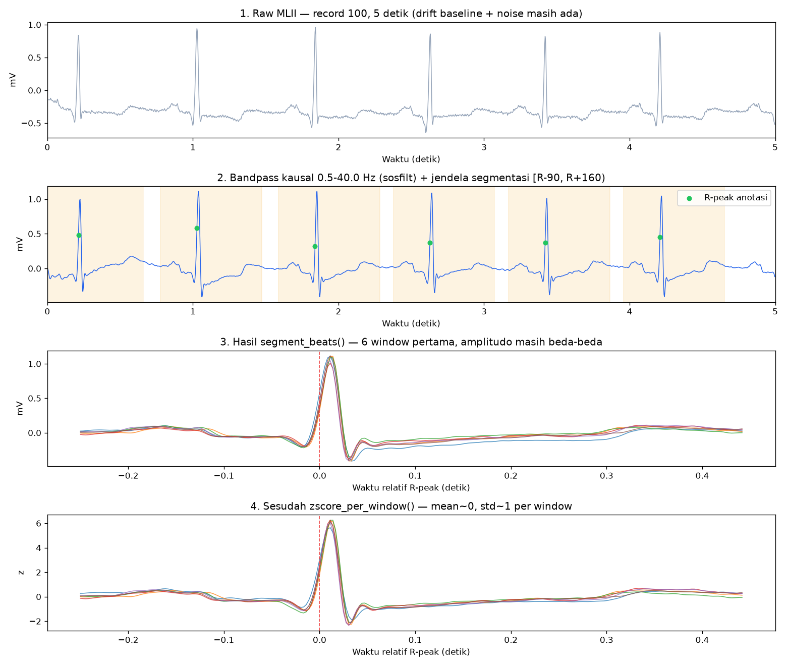
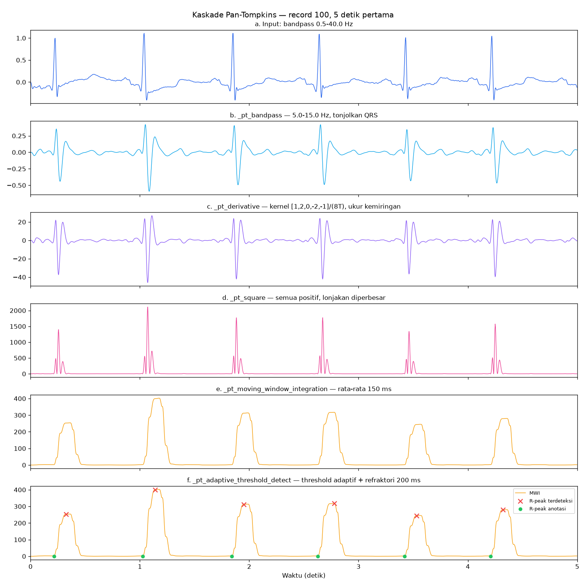

# Walkthrough `src/preprocessing.py` — Fase 1

Dokumen belajar, bukan spesifikasi. Spesifikasi resmi tetap
`PRD_Model_Aritmia_TinyML.pdf` hal. 7–9. Lanjutan dari
[`io-mitdb-walkthrough.md`](io-mitdb-walkthrough.md) (Fase 0). Semua angka & gambar di sini dari
**record 100, 5 detik pertama** (`fs = 360 Hz` → 1800 sampel).

Reproduksi gambar:

```
cd model
.venv/bin/python scripts/plot_walkthrough.py 100
```

> Rumus ditulis LaTeX (`$…$`). Kalau viewer-mu tidak render math (VS Code preview
> bawaan perlu ekstensi "Markdown+Math"), buka di GitHub atau pakai
> `Markdown Preview Enhanced`.

---

## 0. Peta besar — ada DUA jalur, jangan tertukar

```
                      load_record()  →  signal mentah + r_locations (ANOTASI)
                             │
                             ▼
        ┌──── apply_bandpass(signal, design_bandpass_sos())   ◄── 0.5–40 Hz
        │                    │
        │  JALUR TRAINING    ├──► segment_beats(filtered, r_locations)   ◄── R dari anotasi
        │                    │            │
        │                    │            ▼
        │                    │      zscore_per_window(...)  ──► (N, 250) float32 → Fase 2
        │                    │
        └──── JALUR BENCHMARK└──► pan_tompkins_detect(filtered)  ──► indeks R hasil deteksi
                                        (dibandingkan dengan anotasi, TIDAK masuk training)
```

Kenapa dipisah: segmentasi training pakai R-peak **anotasi kardiolog** supaya
error detektor tidak mencemari label model (keputusan terkunci, PRD Fase 2).
Pan-Tompkins ada di file yang sama karena nanti dia yang jalan di ESP32 —
kita cuma perlu tahu **seberapa akurat dia** sebelum ditulis ulang di C.



---

## 1. `design_bandpass_sos()` — desain filter Butterworth

```python
sos = butter(BANDPASS_ORDER, [BANDPASS_LOW, BANDPASS_HIGH],
             btype="bandpass", fs=FS, output="sos")
```

### Kenapa bandpass 0.5–40 Hz

Sinyal EKG mentah = QRS (5–15 Hz) + gelombang P/T (0.5–10 Hz) + sampah:

| Gangguan | Frekuensi | Dibuang oleh |
|---|---|---|
| Baseline wander (napas, gerak elektroda) | < 0.5 Hz | highpass 0.5 Hz |
| EMG / noise otot | > 40 Hz | lowpass 40 Hz |
| Interferensi listrik PLN | 50/60 Hz | lowpass 40 Hz |

Lihat panel 1 vs 2 di gambar: garis dasar yang melayang di $-0.3$ mV jadi rata di
nol. Angkanya: `mean` raw $= -0.3063$ → filtered $= +0.0000$.

### Matematika Butterworth

Respons magnitudo lowpass Butterworth orde $n$ dengan cutoff $\omega_c$:

$$|H(j\omega)|^2 = \frac{1}{1 + \left(\dfrac{\omega}{\omega_c}\right)^{2n}}$$

Sifatnya: **maximally flat** di passband (tidak bergelombang seperti Chebyshev),
roll-off $-20n$ dB/dekade. Orde 4 → $-80$ dB/dekade. Bandpass dibuat dengan
transformasi frekuensi lowpass→bandpass, jadi orde efektif jadi $2n = 8$
(8 pole), yang di SciPy jadi 4 buah second-order section.

### Kenapa `output="sos"` bukan `"ba"`

Bentuk `ba` = satu polinomial orde 8. Koefisiennya beda orde-orde besaran
→ galat pembulatan float bisa bikin filter **tidak stabil**. SOS memecahnya jadi
kaskade biquad:

$$H(z) = \prod_{k=1}^{4} \frac{b_{0k} + b_{1k}z^{-1} + b_{2k}z^{-2}}{1 + a_{1k}z^{-1} + a_{2k}z^{-2}}$$

Tiap section cuma orde 2 → numerik aman. Bonus: format ini persis yang nanti
ditulis ulang di firmware C sebagai 4 biquad berantai.

---

## 2. `apply_bandpass()` — eksekusi filter

```python
return sosfilt(sos, signal, axis=0, zi=None)
```

Satu section biquad = persamaan beda (difference equation):

$$y[n] = b_0 x[n] + b_1 x[n-1] + b_2 x[n-2] - a_1 y[n-1] - a_2 y[n-2]$$

Perhatikan: **hanya indeks $\le n$**. Itu definisi *kausal* — output saat ini
cuma butuh masa lalu.

### JEBAKAN #1 PRD: `sosfilt`, BUKAN `filtfilt`

`filtfilt` memfilter maju lalu **mundur** ($y[n]$ butuh $x[n+k]$). Hasilnya
zero-phase, kelihatan cantik di plot — tapi butuh seluruh sinyal tersimpan.
Di ESP32 yang streaming sampel satu per satu, itu mustahil. Kalau training pakai
`filtfilt` dan device pakai kausal, distribusi input model beda → akurasi anjlok
di lapangan (*train/deploy mismatch*).

Harga yang kita bayar: **group delay**. Filter kausal menggeser sinyal ke kanan.
Itu tidak masalah untuk klasifikasi (semua beat digeser sama rata), tapi jadi
penting di Pan-Tompkins — lihat §3.6.

### Cek cepat

```python
np.allclose(sosfilt(sos, x)[:100], sosfilt(sos, x[:100]))   # True — kausal
```
Kalau potongan awal hasil filter berubah saat sinyal diperpanjang, berarti bocor
ke masa depan (bug).

---

## 3. Pan-Tompkins — kaskade 5 tahap



Ide dasarnya: QRS itu **lonjakan curam berdurasi ~80–120 ms**. Kalau kita bikin
sinyal turunan yang dikuadratkan lalu diratakan, QRS jadi satu bukit gemuk yang
gampang dipisah dengan threshold, sementara P/T (landai) dan noise (sempit)
tenggelam.

### 3.1 `_pt_bandpass` — 5–15 Hz

```python
sos = butter(PT_BAND_ORDER, [PT_BAND_LOW, PT_BAND_HIGH], btype="bandpass", fs=fs, output="sos")
```

Bandpass **kedua**, lebih sempit dari yang di §1. Tujuannya beda: §1 bersihkan
sinyal untuk *dilihat model*; ini menonjolkan pita energi QRS untuk *dideteksi*.
Panel (b): gelombang T yang tadinya jelas jadi kecil, QRS tetap dominan.

Orde 2 (bukan 4) — cukup, dan makin rendah orde makin kecil delay.

### 3.2 `_pt_derivative` — ukur kemiringan

Kernel klasik Pan-Tompkins:

$$y[n] = \frac{1}{8T}\bigl(-x[n-2] - 2x[n-1] + 2x[n+1] + x[n+2]\bigr)$$

Itu **non-kausal** (ada $x[n+1]$, $x[n+2]$). Trik di kode: geser 2 sampel supaya
jadi kausal —

```python
b = np.array([1, 2, 0, -2, -1]) / (8 * T)
lfilter(b, [1.0], signal)
```

yang mengimplementasikan

$$y[n] = \frac{1}{8T}\bigl(x[n] + 2x[n-1] - 2x[n-3] - x[n-4]\bigr)$$

Bentuknya identik, cuma **tertunda 2 sampel** ($\approx 5.6$ ms). Ini pendekatan
turunan beda-terpusat: $y \approx \dfrac{dx}{dt}$, satuannya mV/detik — makanya
sumbu-y panel (c) melompat ke orde puluhan.

Kenapa turunan? QRS punya slope paling curam di seluruh EKG. Gelombang T besar
tapi landai → turunannya kecil → otomatis tertekan.

### 3.3 `_pt_square` — kuadratkan

$$y[n] = x[n]^2$$

Dua efek: (1) semua jadi positif, jadi slope naik & slope turun sama-sama
berkontribusi; (2) non-linear — yang besar dibesarkan lebih dari yang kecil.
Rasio QRS : noise ikut membesar kuadratik. Panel (d): $\pm 45$ jadi $\approx 2000$.

### 3.4 `_pt_moving_window_integration` — ratakan 150 ms

```python
n = round(PT_MWI_WINDOW_MS / 1000 * fs)   # 150 ms * 360 Hz = 54 sampel
b = np.ones(n) / n
lfilter(b, [1.0], signal)
```

Moving average kausal:

$$y[n] = \frac{1}{N}\sum_{k=0}^{N-1} x[n-k], \qquad N = 54$$

Panel (d) punya 2–3 spike per QRS (slope naik, slope turun). Setelah diratakan,
mereka melebur jadi **satu bukit tunggal** (panel e) — jauh lebih enak
di-threshold. Lebar jendela sengaja $\approx$ lebar QRS: kalau terlalu sempit,
bukitnya tetap pecah; terlalu lebar, QRS dan gelombang T bisa menyatu.

### 3.5 `_pt_adaptive_threshold_detect` — ambil puncaknya

Threshold tetap tidak jalan: amplitudo EKG berubah antar-pasien, bahkan
antar-menit. Pan-Tompkins memakai dua estimator berjalan:

- $\text{SPKI}$ — level puncak sinyal (QRS)
- $\text{NPKI}$ — level puncak noise

Ambang:

$$\text{THRESHOLD}_1 = \text{NPKI} + 0.25\,(\text{SPKI} - \text{NPKI})$$

yaitu 25% jalan dari lantai-noise menuju level-sinyal. Tiap kandidat puncak
lokal $x$ mengupdate salah satu estimator dengan low-pass eksponensial:

$$\text{SPKI} \leftarrow 0.125\,x + 0.875\,\text{SPKI} \quad \text{(jika } x > \text{THRESHOLD}_1\text{)}$$
$$\text{NPKI} \leftarrow 0.125\,x + 0.875\,\text{NPKI} \quad \text{(jika tidak)}$$

Konstanta $0.125 = 1/8$ → adaptasi lambat (time constant $\approx 8$ puncak),
jadi satu artefak besar tidak langsung merusak threshold.

Kandidat puncak dicari vektorisasi, bukan loop:

```python
candidates = np.where(
    (integrated[1:-1] > integrated[:-2]) & (integrated[1:-1] >= integrated[2:])
)[0] + 1
```

Baca: sampel $i$ adalah puncak lokal jika $x_{i-1} < x_i \ge x_{i+1}$. Asimetris
(`>` di kiri, `>=` di kanan) — supaya plateau datar tidak menghasilkan nol
puncak maupun puncak ganda. `+ 1` mengembalikan offset karena slicing `[1:-1]`.

Inisialisasi dari 2 detik pertama:

```python
spki = max(integrated[:2*fs])      # asumsi ada minimal 1 QRS di 2 detik
npki = mean(integrated[:2*fs])
```

**Refraktori** — periode fisiologis di mana jantung tidak bisa depolarisasi lagi:

$$i - i_{\text{last}} \ge \frac{200\,\text{ms}}{1000}\,f_s = 72\ \text{sampel}$$

200 ms $\Rightarrow$ maksimum 300 bpm. Ini yang mencegah satu QRS terhitung dua
kali (mis. gelombang R dan S berdekatan).

### 3.6 Yang harus kamu sadari dari gambar

Di panel (f): silang merah (deteksi) **konsisten lebih kanan** dari bulat hijau
(anotasi). Delay median terukur **40 sampel = 111 ms**, dan itu bukan bug — itu
jumlah group delay bandpass 5–15 Hz + 2 sampel derivative + $\approx N/2 = 27$
sampel MWI. Konsekuensinya:

- Untuk benchmark, toleransi $\pm 150$ ms (`bench_pantompkins.py`) menutupi delay ini.
- Kalau nanti Pan-Tompkins dipakai untuk segmentasi on-device, **delay harus
  dikompensasi** (geser indeks ke kiri), atau window-nya bergeser sistematis dari
  yang dilihat model saat training.

Skor record 100 hari ini: `TP=2263  FN=10  FP=9` → sensitivity 0.996,
precision 0.996.

---

## 4. `segment_beats()` — potong per detak

```python
start, end = r - WIN_PRE, r + WIN_POST      # 90 sebelum, 160 sesudah
if start < 0 or end > len(signal): continue
```

Tiap beat jadi window $[R-90,\ R+160)$ = **250 sampel = 694 ms**, dengan R-peak
selalu di indeks 90. Alignment tetap ini penting: CNN 1-D belajar pola relatif
posisi, jadi kalau R-peak berpindah-pindah tiap sampel, model harus buang
kapasitas untuk belajar invariansi geser.

Pembagian asimetris (90 sebelum, 160 sesudah) mengikuti anatomi:

| Bagian | Perkiraan durasi | Masuk window? |
|---|---|---|
| Gelombang P + interval PR | ~200 ms | ya (90 sampel = 250 ms) |
| QRS | 80–120 ms | ya |
| Segmen ST + gelombang T | ~300–400 ms | ya (160 sampel = 444 ms) |

Gelombang T harus ikut karena morfologinya membedakan PVC dari beat normal.

Guard `start < 0 or end > len(signal)` membuang beat di tepi rekaman. Record 100:
**2 dari 2273 beat terbuang** (indeks 77 di awal, 649991 di akhir dari 650000
sampel) → tersisa 2271 window. Cek `len(window) != WIN_LEN` setelahnya redundan
secara logika, tapi murah dan bikin kontrak `(N, 250)` tidak bisa bohong.

Return `np.empty((0, WIN_LEN))` saat kosong, bukan `[]` — supaya `.shape[1]` di
hilir tetap valid dan tidak perlu cek None.

---

## 5. `zscore_per_window()` — normalisasi per detak

$$z_i[n] = \frac{x_i[n] - \mu_i}{\sigma_i + \varepsilon}, \qquad
\mu_i = \frac{1}{L}\sum_{n} x_i[n], \quad
\sigma_i = \sqrt{\frac{1}{L}\sum_n (x_i[n]-\mu_i)^2}$$

dengan $L = 250$, $\varepsilon = 10^{-8}$.

```python
mean = windows.mean(axis=1, keepdims=True)   # (N, 1) — per window, bukan global
```

`axis=1` = statistik dihitung **per baris**. Ini keputusan yang di-lock, dan
alasannya dua:

1. **Kebal beda amplitudo.** Gain elektroda, impedansi kulit, dan posisi lead
   bikin pasien A punya QRS 1.2 mV sementara pasien B 0.4 mV. Setelah z-score
   per window, keduanya jadi bentuk yang sebanding — model belajar *morfologi*,
   bukan *seberapa besar sinyalnya*.
2. **Nol kebocoran statistik.** Kalau $\mu,\sigma$ dihitung dari seluruh dataset
   train, statistik itu ikut ke test set → *data leakage*. Per-window tidak butuh
   apa pun dari luar window itu, jadi di device pun bisa dihitung on the fly.

$\varepsilon$ mencegah pembagian nol pada window flat (elektroda lepas → sinyal
konstan → $\sigma = 0$). Tanpa itu, satu window rusak menghasilkan `NaN` yang
menjalar ke seluruh gradien training.

Panel 3 vs 4 di gambar pertama: bentuknya identik, skalanya yang berubah — dari
mV ke satuan "berapa simpangan baku". Verifikasi: `z.mean() = -0.0000`,
`z.std() = 1.0000`.

Cast `float32` di akhir: setengah memori `float64` dan format yang sama dengan
input TFLite nanti.

---

## 6. Angka record 100 (rujukan cepat)

```
anotasi          = 2273 beat        window valid = 2271   dibuang = 2
raw      mean = -0.3063   std = 0.1932
filtered mean = +0.0000   std = 0.1840
z-score  mean = -0.0000   std = 1.0000
Pan-Tompkins: TP=2263  FN=10  FP=9  → Se=0.996  P+=0.996  (±150 ms)
delay deteksi median = 40 sampel = 111 ms
```

---

## 7. Cek pemahaman

1. Kalau `BANDPASS_ORDER` diubah 4 → 2, apa yang berubah di panel PSD
   `make plot1`, dan kenapa itu penting untuk port ke C?
2. Kenapa `_pt_derivative` boleh digeser 2 sampel tanpa merusak deteksi, tapi
   `filtfilt` tidak boleh dipakai sama sekali? (Petunjuk: konstan vs
   bergantung-masa-depan.)
3. `WIN_POST` dinaikkan 160 → 200. Berapa beat yang terbuang di record 100, dan
   bagian gelombang apa yang mulai ikut tercakup?
4. Kalau `zscore_per_window` diganti normalisasi global (satu $\mu,\sigma$ untuk
   semua window), metrik mana yang naik palsu saat evaluasi inter-patient?

## 8. Skrip pendukung

| Perintah | Melihat apa |
|---|---|
| `python scripts/plot_fase1.py 100` | Domain waktu + spectrogram + PSD sebelum/sesudah filter |
| `python scripts/plot_fase1_segment.py 100` | 8 window, sebelum vs sesudah z-score |
| `python scripts/bench_pantompkins.py 100` | Deteksi vs anotasi + Se/P+ |
| `python scripts/plot_walkthrough.py 100` | Dua gambar di dokumen ini |

---

**[← Fase 0 — io_mitdb](io-mitdb-walkthrough.md)**  ·  [Peta walkthrough](README.md)  ·  **[Fase 2 — features_rr →](features-rr-walkthrough.md)**
